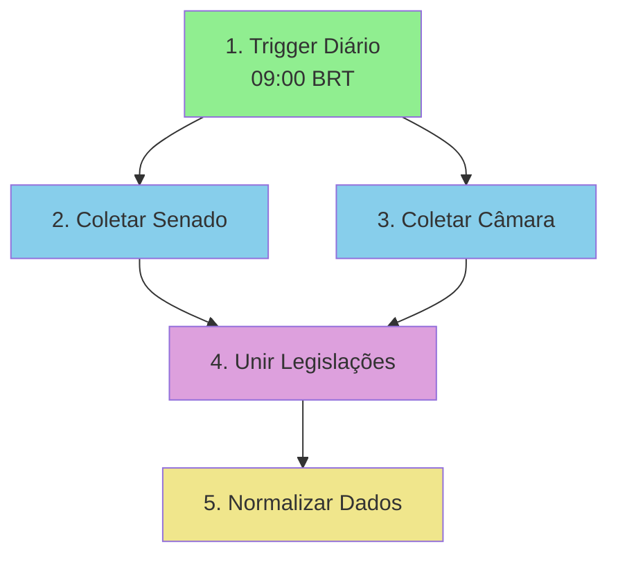

# 📊 Diagrama Visual do Workflow LegisClara

## 🎯 Visão Geral do Fluxo

```
┌─────────────────────────────────────────────────────────────────┐
│                    LEGISCLARA N8N PIPELINE                      │
│                                                                 │
│  ⏰ Execução: Diária às 09:00                                   │
│  ⏱️ Duração: ~10-15 minutos                                     │
│  💰 Custo: $0.99 por legislação                                 │
└─────────────────────────────────────────────────────────────────┘
```

---

## 📋 Fluxo Completo (16 Nós)

### FASE 1: COLETA (Nós 1-4)



**Detalhes:**

```
┌─────────────────────────────────────────────────────────────────┐
│ 1. ⏰ TRIGGER DIÁRIO                                            │
├─────────────────────────────────────────────────────────────────┤
│ Tipo: Schedule Trigger                                         │
│ Horário: 09:00 (America/Sao_Paulo)                            │
│ Frequência: Diária                                             │
│ Output: { timestamp, date }                                     │
└─────────────────────────────────────────────────────────────────┘
                           ↓
┌─────────────────────────────────────────────────────────────────┐
│ 2. 📡 COLETAR SENADO                                           │
├─────────────────────────────────────────────────────────────────┤
│ API: https://legis.senado.leg.br/dadosabertos/...             │
│ Filtros:                                                       │
│  - tramitando=S                                                │
│  - dataInicio: Últimos 7 dias                                  │
│  - dataFim: Hoje                                               │
│ Output: [ PEC, PL, MP, ... ] (até 5 de cada)                   │
│ Tempo: ~5-10s                                                  │
└─────────────────────────────────────────────────────────────────┘
                           ↓
┌─────────────────────────────────────────────────────────────────┐
│ 3. 📡 COLETAR CÂMARA                                           │
├─────────────────────────────────────────────────────────────────┤
│ API: https://dadosabertos.camara.leg.br/api/v2/...            │
│ Filtros: Mesmos do Senado                                     │
│ Output: [ PL, PLP, PDL, ... ] (até 5 de cada)                  │
│ Tempo: ~5-10s                                                  │
└─────────────────────────────────────────────────────────────────┘
                           ↓
┌─────────────────────────────────────────────────────────────────┐
│ 4. 🔗 UNIR LEGISLAÇÕES                                         │
├─────────────────────────────────────────────────────────────────┤
│ Tipo: Merge Node                                              │
│ Modo: Combine All                                             │
│ Output: [ Senado items, Câmara items ]                         │
└─────────────────────────────────────────────────────────────────┘
                           ↓
┌─────────────────────────────────────────────────────────────────┐
│ 5. 🔄 NORMALIZAR DADOS                                         │
├─────────────────────────────────────────────────────────────────┤
│ Tipo: Code (JavaScript)                                       │
│ Função: Unificar estrutura de dados                           │
│ Output: {                                                      │
│   fonte: 'senado' | 'camara',                                  │
│   tipo: 'PEC' | 'PL' | 'MP',                                   │
│   numero: '123',                                               │
│   ano: '2025',                                                 │
│   ementa: 'Dispõe sobre...',                                   │
│   data_apresentacao: '2025-01-22',                             │
│   url: 'https://...',                                          │
│   id_origem: 'xxx'                                             │
│ }                                                              │
└─────────────────────────────────────────────────────────────────┘
```

---

### FASE 2: PROCESSAMENTO IA (Nós 6-7)

```
┌─────────────────────────────────────────────────────────────────┐
│ 6. 🤖 PROCESSAR COM OPENAI (ChatGPT)                           │
├─────────────────────────────────────────────────────────────────┤
│ Modelo: gpt-4o-mini                                            │
│ Prompt: "Analise esta legislação e forneça..."                │
│                                                                 │
│ Input:                                                         │
│   - Tipo, Número, Ano                                          │
│   - Ementa completa                                            │
│                                                                 │
│ Output (JSON):                                                 │
│   {                                                            │
│     "resumo_simples": "Em 100 palavras...",                    │
│     "grupos_impactados": [                                     │
│       "Microempreendedores",                                   │
│       "Trabalhadores CLT",                                     │
│       "Aposentados"                                            │
│     ],                                                         │
│     "pontos_polemicos": [                                      │
│       "Aumento de impostos",                                   │
│       "Redução de direitos"                                    │
│     ],                                                         │
│     "roteiro_video": "Olá! Hoje vou explicar...",             │
│     "pergunta_engajadora": "Você concorda com...?"            │
│   }                                                            │
│                                                                 │
│ Tempo: ~10-15s por legislação                                  │
│ Custo: $0.30 por legislação                                    │
└─────────────────────────────────────────────────────────────────┘
                           ↓
┌─────────────────────────────────────────────────────────────────┐
│ 7. 📤 EXTRAIR ANÁLISE                                          │
├─────────────────────────────────────────────────────────────────┤
│ Tipo: Code (JavaScript)                                       │
│ Função:                                                        │
│   1. Extrair JSON da resposta OpenAI                           │
│   2. Validar campos obrigatórios                               │
│   3. Adicionar metadata (processado_em, etc)                   │
│                                                                 │
│ Output: Legislação + Análise IA completa                       │
└─────────────────────────────────────────────────────────────────┘
```

---

### FASE 3: GERAÇÃO DE MÍDIA (Nós 8-11)

```
┌─────────────────────────────────────────────────────────────────┐
│ 8. 🎙️ GERAR ÁUDIO (ElevenLabs)                                 │
├─────────────────────────────────────────────────────────────────┤
│ API: https://api.elevenlabs.io/v1/text-to-speech/...          │
│ Voz: Rachel (Multilingual V2)                                 │
│ Input: roteiro_video (600-800 caracteres)                      │
│ Output: audio.mp3 (60-90 segundos)                             │
│                                                                 │
│ Configurações:                                                 │
│   - stability: 0.5                                             │
│   - similarity_boost: 0.75                                     │
│   - model: eleven_multilingual_v2                              │
│                                                                 │
│ Tempo: ~5-8s                                                   │
│ Custo: $0.15 (ou GRÁTIS se <10k chars/mês)                     │
└─────────────────────────────────────────────────────────────────┘
                           ↓
┌─────────────────────────────────────────────────────────────────┐
│ 9. 🎬 GERAR VÍDEO (D-ID)                                       │
├─────────────────────────────────────────────────────────────────┤
│ API: https://api.d-id.com/talks                               │
│ Avatar: URL do presenter escolhido                             │
│ Input: URL do áudio (ElevenLabs)                               │
│                                                                 │
│ Configurações:                                                 │
│   - fluent: true (movimentos naturais)                         │
│   - pad_audio: 0                                               │
│   - result_format: mp4                                         │
│   - expressions: neutral                                       │
│                                                                 │
│ Response: { id: "tlk_xxx", status: "created" }                 │
│                                                                 │
│ Tempo: Imediato (processamento assíncrono)                     │
│ Custo: $0.50 (ou GRÁTIS com créditos trial)                    │
└─────────────────────────────────────────────────────────────────┘
                           ↓
┌─────────────────────────────────────────────────────────────────┐
│ 10. ⏳ AGUARDAR PROCESSAMENTO                                  │
├─────────────────────────────────────────────────────────────────┤
│ Tipo: Code (JavaScript) - Polling Loop                        │
│                                                                 │
│ Lógica:                                                        │
│   1. Pegar video_id do nó anterior                             │
│   2. Loop (máx 30 tentativas):                                 │
│      a. Consultar GET /talks/{id}                              │
│      b. Se status = "done" → continuar                         │
│      c. Se status = "error" → lançar erro                      │
│      d. Senão: aguardar 10s e repetir                          │
│                                                                 │
│ Tempo: 2-5 minutos (processamento D-ID)                        │
│ Output: { result_url: "https://...video.mp4" }                 │
└─────────────────────────────────────────────────────────────────┘
                           ↓
┌─────────────────────────────────────────────────────────────────┐
│ 11. ⬇️ BAIXAR VÍDEO                                            │
├─────────────────────────────────────────────────────────────────┤
│ Tipo: HTTP Request                                            │
│ URL: result_url (do D-ID)                                      │
│ Response Format: File (binary)                                 │
│                                                                 │
│ Output: Vídeo MP4 (1080x1920, 9:16, ~10MB)                     │
│                                                                 │
│ ⚠️ IMPORTANTE: URLs do D-ID expiram em 24h!                    │
│    Baixar e fazer upload IMEDIATAMENTE                         │
└─────────────────────────────────────────────────────────────────┘
```

---

### FASE 4: ARMAZENAMENTO (Nó 12)

```
┌─────────────────────────────────────────────────────────────────┐
│ 12. ☁️ UPLOAD SUPABASE                                         │
├─────────────────────────────────────────────────────────────────┤
│ Serviço: Supabase Storage                                     │
│ Bucket: videos (público)                                       │
│ Filename: {fonte}_{tipo}_{numero}_{ano}.mp4                    │
│                                                                 │
│ Processo:                                                      │
│   1. Pegar binary do vídeo (nó anterior)                       │
│   2. Upload para bucket "videos"                               │
│   3. Gerar URL pública                                         │
│                                                                 │
│ Output: {                                                      │
│   video_url_publica: "https://xxx.supabase.co/storage/...",   │
│   tamanho_mb: 10.5,                                            │
│   duracao_segundos: 62                                         │
│ }                                                              │
│                                                                 │
│ Tempo: ~5-10s (depende do tamanho)                             │
│ Custo: GRÁTIS (até 500MB)                                      │
└─────────────────────────────────────────────────────────────────┘
```

---

### FASE 5: PUBLICAÇÃO (Nós 13-15)

```
┌─────────────────────────────────────────────────────────────────┐
│ 13. 📝 GERAR CAPTION                                           │
├─────────────────────────────────────────────────────────────────┤
│ Tipo: Code (JavaScript)                                       │
│                                                                 │
│ Template:                                                      │
│   🏛️ {tipo} {numero}/{ano}                                     │
│                                                                 │
│   {resumo_simples}                                             │
│                                                                 │
│   👥 Quem é impactado:                                         │
│   1. {grupo_1}                                                 │
│   2. {grupo_2}                                                 │
│   3. {grupo_3}                                                 │
│                                                                 │
│   💬 {pergunta_engajadora}                                     │
│                                                                 │
│   #LegisClara #Política #Cidadania #{tipo}{numero}             │
│                                                                 │
│ Limite: 2.200 caracteres (Instagram)                           │
│ Hashtags: 5-10 relevantes                                      │
└─────────────────────────────────────────────────────────────────┘
                           ↓
┌─────────────────────────────────────────────────────────────────┐
│ 14. 📱 PUBLICAR INSTAGRAM                                      │
├─────────────────────────────────────────────────────────────────┤
│ Tipo: Instagram Business API                                  │
│ Endpoint: /media (criar) + /media_publish (publicar)           │
│                                                                 │
│ Parâmetros:                                                    │
│   - media_type: REELS                                          │
│   - video_url: URL pública Supabase                            │
│   - caption: Gerada no nó anterior                             │
│   - share_to_feed: true                                        │
│                                                                 │
│ Processo:                                                      │
│   1. CREATE container                                          │
│   2. Aguardar upload (~30s)                                    │
│   3. PUBLISH container                                         │
│                                                                 │
│ Output: {                                                      │
│   id: "instagram_post_id",                                     │
│   permalink: "https://instagram.com/p/xxx"                     │
│ }                                                              │
│                                                                 │
│ Tempo: ~30-60s                                                 │
│ Custo: GRÁTIS                                                  │
└─────────────────────────────────────────────────────────────────┘
                           ↓
┌─────────────────────────────────────────────────────────────────┐
│ 15. 💾 SALVAR NO BANCO                                         │
├─────────────────────────────────────────────────────────────────┤
│ Tabela: publicacoes (Supabase PostgreSQL)                     │
│                                                                 │
│ Campos salvos:                                                 │
│   - legislacao_id                                              │
│   - plataforma: "instagram"                                    │
│   - post_id                                                    │
│   - url (permalink)                                            │
│   - caption                                                    │
│   - video_url                                                  │
│   - status: "publicado"                                        │
│   - data_publicacao: NOW()                                     │
│                                                                 │
│ Útil para:                                                     │
│   - Coletar feedback depois (comentários)                      │
│   - Analytics                                                  │
│   - Evitar duplicatas                                          │
└─────────────────────────────────────────────────────────────────┘
```

---

### FASE 6: NOTIFICAÇÃO (Nó 16)

```
┌─────────────────────────────────────────────────────────────────┐
│ 16. 📧 NOTIFICAR (Email/Discord/Slack)                         │
├─────────────────────────────────────────────────────────────────┤
│ Opção 1: Email (SMTP)                                         │
│   Para: parlamentares, cidadãos, equipe                        │
│   Assunto: "📊 Nova Legislação Publicada"                      │
│   Corpo: Resumo + Link Instagram                              │
│                                                                 │
│ Opção 2: Discord (Webhook)                                    │
│   Mensagem formatada com embed                                 │
│                                                                 │
│ Opção 3: Slack (Webhook)                                      │
│   Notificação na equipe                                        │
│                                                                 │
│ Conteúdo típico:                                               │
│   ✅ Pipeline concluído!                                       │
│   📊 5 legislações processadas                                 │
│   🎬 5 vídeos gerados                                          │
│   📱 5 posts publicados                                        │
│   🔗 Links: [Instagram 1] [Instagram 2] ...                    │
└─────────────────────────────────────────────────────────────────┘
```

---

## ⏱️ Timeline Típica

```
00:00 - Trigger dispara
00:05 - Coleta concluída (Senado + Câmara)
00:10 - Normalização concluída
01:00 - Processamento IA concluído (5 legislações)
01:30 - Áudios gerados (5x)
01:35 - Vídeos criados no D-ID (aguardando...)
06:00 - Todos vídeos prontos (D-ID)
06:30 - Uploads Supabase concluídos
07:00 - Captions geradas
09:30 - Publicações Instagram concluídas (5x)
09:35 - Banco atualizado
09:40 - Notificações enviadas
10:00 - PIPELINE COMPLETO! ✅

TOTAL: ~10 minutos
```

---

## 💰 Custos por Nó

| Nó | Serviço | Custo/Exec | Plano Free |
|----|---------|------------|------------|
| 1-5 | Coleta + Normalização | $0 | ✅ Sempre |
| 6-7 | OpenAI GPT-4 | $0.30 | ❌ $5 inicial |
| 8 | ElevenLabs | $0.15 | ✅ 10k chars |
| 9-11 | D-ID | $0.50 | ✅ Trial |
| 12 | Supabase | $0 | ✅ 500MB |
| 13-15 | Instagram + DB | $0 | ✅ Sempre |
| 16 | Notificações | $0 | ✅ Sempre |
| **TOTAL** | | **$0.99** | **MVP grátis** |

---

## 🔀 Fluxos Alternativos

### Modo Teste (Sem Publicação)

```
1-7: Normal (coleta → processa)
8-12: Normal (gera vídeo)
13-15: DESCONECTAR (não publicar)
16: Modificar (apenas log local)

Útil para: Validar vídeos antes de publicar
```

### Modo Rápido (Sem D-ID)

```
1-7: Normal
8: ElevenLabs (áudio)
9-11: PULAR (sem vídeo)
12: Upload apenas áudio
13-15: Publicar como post estático (imagem + áudio)

Útil para: Reduzir custos (sem avatar)
```

### Modo Batch (Processar Muitos)

```
1-5: Coletar TODAS legislações (sem limite)
6-7: Processar em lote (batch OpenAI)
8-16: Loop para cada legislação

Útil para: Processar backlog
```

---

## 📊 Métricas de Monitoramento

```javascript
// Adicionar ao final do workflow

const metrics = {
  execucao_id: $execution.id,
  data: new Date().toISOString(),

  // Input
  legislacoes_coletadas: $('4. Normalizar Dados').all().length,

  // Processing
  processamentos_sucesso: $('7. Extrair Análise').all().length,
  processamentos_erro: 0,  // contar erros

  // Media
  audios_gerados: $('8. Gerar Áudio').all().length,
  videos_gerados: $('11. Baixar Vídeo').all().length,

  // Publishing
  publicacoes_sucesso: $('14. Publicar Instagram').all().length,

  // Timing
  tempo_total_segundos: (Date.now() - $execution.startedAt) / 1000,

  // Custos estimados
  custo_openai: processamentos_sucesso * 0.30,
  custo_elevenlabs: audios_gerados * 0.15,
  custo_did: videos_gerados * 0.50,
  custo_total: (processamentos_sucesso * 0.30) +
               (audios_gerados * 0.15) +
               (videos_gerados * 0.50)
};

// Salvar métricas no Supabase
await supabase.from('metricas_execucao').insert(metrics);
```

---

## ✅ Checklist de Validação

Antes de ativar workflow em produção:

- [ ] Todas credenciais configuradas
- [ ] Teste manual passou 100%
- [ ] Bucket Supabase criado e público
- [ ] Tabela `publicacoes` criada
- [ ] Instagram Business Account conectado
- [ ] Vídeo de teste publicado com sucesso
- [ ] Notificações funcionando
- [ ] Métricas sendo coletadas
- [ ] Backup do workflow exportado
- [ ] Documentação lida e compreendida

**Pronto para produção! 🚀**
